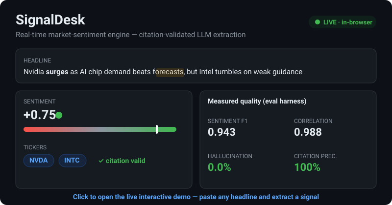
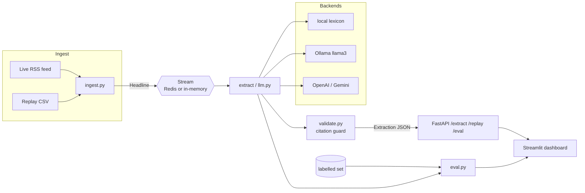

# 📈 SignalDesk — Real-Time Market-Sentiment Engine

> Citation-validated, eval-backed sentiment extraction from financial news — every call is grounded in a span that provably exists in the source.

<p align="center">
  <a href="https://maxmilliamokafor.github.io/signaldesk/"><b>🔴 LIVE DEMO</b></a>
  &nbsp;·&nbsp;
  <a href="#-results-measured">Results</a>
  &nbsp;·&nbsp;
  <a href="#-architecture">Architecture</a>
  &nbsp;·&nbsp;
  <a href="#-the-differentiator--eval-harness">Eval harness</a>
</p>

<p align="center">
  
  
  
  
</p>

<p align="center">
  <a href="https://maxmilliamokafor.github.io/signaldesk/">
    
  </a>
  <br>
  <em><a href="https://maxmilliamokafor.github.io/signaldesk/">▶ Open the live demo</a> — runs entirely in your browser, no install.</em>
</p>

---

## What it does

SignalDesk ingests a stream of financial-news headlines and, for each one, an LLM
extracts a structured signal:

```json
{
  "tickers": ["NVDA"],
  "sentiment": 0.75,
  "rationale": "Headline signals a bullish read for NVDA on the cue 'surges'.",
  "source_span": "surges",
  "citation_ok": true
}
```

The **`source_span` must be a verbatim substring of the headline**. If a model
returns a span that isn't in the source, the result is flagged as a
hallucination (`citation_ok = false`) — this is the anti-hallucination guard.
Results stream to a live Streamlit dashboard with a per-ticker sentiment chart
and an expandable feed showing each citation.

## 🔬 The differentiator — eval harness

Anyone can wire an LLM to a dashboard. The signal that this is *trustworthy*
GenAI is the eval harness. A hand-labelled set of **36 headlines**
(`data/eval_labeled.csv`) is scored on:

- **Hallucination rate** — fraction of cited spans not found in the source.
- **Citation precision** — `1 − hallucination_rate`.
- **Sentiment F1** — macro-F1 of predicted direction vs. label.
- **Sentiment correlation** — Pearson r of predicted vs. labelled score.
- **Ticker Jaccard** — overlap of predicted vs. labelled tickers.
- **Latency / throughput.**

The dashboard's **Model Quality** page runs this live, and CI runs it on every
push.

## 📊 Results (measured)

Run on the bundled labelled set with the default **`local`** backend
(deterministic, key-free) — reproduce with `python -m app.eval`:

| Metric | Value |
| --- | --- |
| Headlines scored | 36 |
| Hallucination rate | **0.0%** |
| Citation precision | **100%** |
| Sentiment F1 (macro) | **0.943** |
| Sentiment correlation | **0.988** |
| Ticker Jaccard | **1.000** |
| Latency / item | **0.062 ms** |
| Throughput | **~15,700 items/s** |

> The `local` backend is a deterministic finance-lexicon extractor; it cites
> real spans by construction, so its hallucination rate is 0 by design — the
> harness exists to keep the **LLM backends** (Ollama / OpenAI / Gemini) honest,
> where fabricated spans are caught and flagged. Numbers above are from a
> single machine; rerun `python -m app.eval` to reproduce on yours.

## 🏗 Architecture



## 🚀 Quickstart

```bash
# 1) One command (API + dashboard)
docker compose up

# API     -> http://localhost:8000/docs
# Dashboard -> http://localhost:8501

# 2) Or run locally
python -m venv .venv && source .venv/bin/activate
pip install -r requirements-dev.txt
uvicorn app.api:app --reload                 # API
streamlit run dashboard/streamlit_app.py     # dashboard
python -m app.eval                           # print eval metrics
pytest                                       # run tests
```

### Choosing a backend

Set `SIGNALDESK_BACKEND` (see `.env.example`):

| Backend | Needs | Notes |
| --- | --- | --- |
| `local` | nothing | Deterministic; default; powers the hosted demo & CI. |
| `ollama` | a running Ollama server | `OLLAMA_MODEL=llama3`. |
| `openai` | `OPENAI_API_KEY` | JSON-mode prompt. |
| `gemini` | `GEMINI_API_KEY` | JSON-mode prompt. |

Any backend's output is run through the **same citation validator** before it
leaves the service. If a configured backend errors at runtime, the service logs
it and falls back to `local` so a demo never goes dark.

## 🧪 Tests & CI

`pytest` covers citation validation (real spans pass, fabricated spans flagged),
extraction behaviour, and the eval harness. GitHub Actions runs ruff + black +
pytest + a live eval smoke test on every push.

## 🧠 Design decisions & trade-offs

- **Citation-as-contract, not as afterthought.** The span-substring check is the
  cheapest possible hallucination guard and runs on *every* backend, so swapping
  in GPT-4o doesn't weaken the safety property. Trade-off: it catches fabricated
  *spans*, not subtly wrong *reasoning* — semantic faithfulness would need an
  NLI model.
- **A deterministic `local` backend as the default.** It makes the demo, CI, and
  eval reproducible with zero keys and zero cost, and gives a non-LLM baseline to
  measure the LLMs against. Trade-off: a lexicon misses sarcasm and novel phrasing
  an LLM would catch — which is exactly why the backend is pluggable.
- **In-memory stream that upgrades to Redis via one env var.** Free hosting tiers
  rarely give you Kafka; `REDIS_URL=""` runs everything in-process, and setting it
  switches to Redis Streams with no code change.
- **Eval baked into the product, not a notebook.** Metrics are a first-class API
  endpoint and dashboard page, so "is the model trustworthy?" is answerable live,
  not buried in a one-off analysis.
- **Graceful backend fallback.** A dead API key degrades to `local` instead of a
  500 — appropriate for a demo, and the fallback is logged so it's never silent.

## 📁 Structure

```
signaldesk/
├── app/            # ingest, extract, llm backends, citation validation, eval, API
├── dashboard/      # Streamlit: live feed + Model Quality page
├── data/           # sample_headlines.csv, eval_labeled.csv (hand-labelled)
├── tests/          # citation, extraction, eval
├── Dockerfile · docker-compose.yml · .github/workflows/ci.yml
└── pyproject.toml · .pre-commit-config.yaml · .env.example
```

## 🔗 Live demo (GitHub Pages)

A self-contained demo lives in [`docs/index.html`](docs/index.html) and is served
free via GitHub Pages at **https://maxmilliamokafor.github.io/signaldesk/** — the link
to put on a CV. It runs in the browser with no backend.

**Enable it once:** either the included workflow `.github/workflows/pages.yml`
deploys it automatically on push (repo *Settings → Pages → Source: GitHub Actions*),
or set *Settings → Pages → Source: Deploy from a branch → `main` / `/docs`*.

## 📜 License

MIT © 2026 Maxmilliam Okafor
